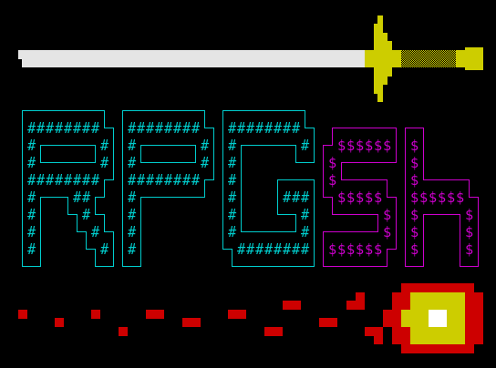

# rpgsh

`rpgsh` is an interactive and extensible shell purpose-built for table-top RPGs like Dungeons and Dragons®, Pathfinder®, and more!

Features include:
- Tab completion  
  
- Get/set/modify variables of differing data types
- Variable substitution
- Dice rolling program
- Templates to allow support for new games to be added easily and by the user

## Disclaimer

This project is entirely developed independantly. I am not associated in anyway with Wizards of the Coast, Paizo, or any other game development company. To any lawyers eyeing me up, I will not be adding information that would negate the need for players to puchase your products.

## Install

Run `sudo ./install.sh; ./install.sh`

## How to Use

Once the project is installed, run the program with the `rpgsh` command.

**WIP:** See `docs/rpgsh-userguide.pdf` for detailed instructions on how everything works.

## Programming Third-Party Applications

**TODO:** See `docs/rpgsh-programmingguide.pdf` for full details.
